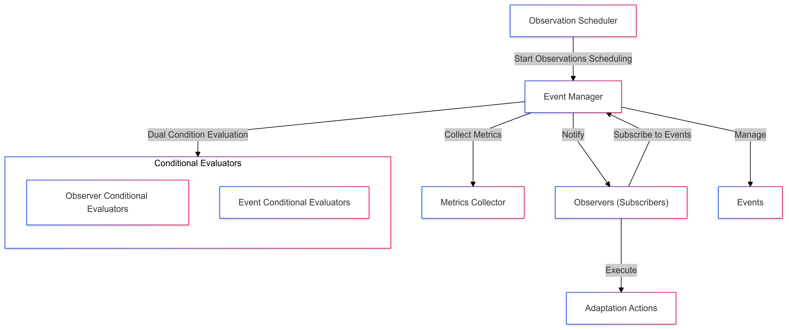

# System Documentation

This documentation provides a comprehensive explanation of the proposed system, focusing on its ability to manage conditional events and support dynamic adaptation. The structure follows a logical flow, from an introduction to detailed architectural explanations, using a component diagram, sequence diagram, and class diagram.

---

## Table of Contents
1. [Introduction](#1-introduction)
2. [Architecture Overview](#2-architecture-overview)
    - [Component Diagram](#21-component-diagram)
    - [Sequence Diagram](#22-sequence-diagram)
    - [Class Diagram](#23-class-diagram)
3. [Metrics Collection](#3-metrics-collection)
    - [Available Collectors](#31-available-collectors)
    - [Usage Examples](#32-usage-examples)
    - [REST API Endpoints for Metrics Collection](#33-rest-api-endpoints-for-metrics-collection)
4. [Adaptation Actions]( #4-adaptation-actions)
   - [Available Adaptation Actions](#41-available-adaptation-actions)
   - [Usage Example: Preventing an Authentication Attack](#42-usage-example-preventing-an-authentication-attack)
   - [REST API Endpoints for Adaptation Actions](#43-rest-api-endpoints-for-adaptation-actions)
5. [Applications](#5-applications)
6. [Conclusion](#6-conclusion)

---

## 1. Introduction

The proposed system is designed to dynamically respond to changing conditions using a combination of metrics evaluation, event management, and adaptation actions. The key objectives include:

1. **Management of Conditional Events:** The system evaluates metrics against predefined conditions and triggers events when conditions are met.
2. **Observer Pattern Integration:** Observers (subscribers) are notified of events to execute relevant adaptation actions.
3. **Dynamic Adaptation:** Enables the system to respond to changes in metrics by triggering specific actions, such as scaling resources or modifying system behavior.
4. **Flexibility and Extensibility:** The modular design supports various metrics, conditions, and actions, making it adaptable to diverse scenarios.

---

## 2. Architecture Overview

### 2.1 Component Diagram



The component diagram provides a high-level view of the system's components and their interactions. The main components include:

- **Metrics Collector:** Collects real-time metrics (e.g., CPU usage, response times).
- **Event Manager:** Central component that evaluates conditions and manages events.
- **Condition Evaluators:** Evaluate whether metrics meet predefined conditions (e.g., `GreaterThanEvaluator`).
- **Event Subscribers:** Observers notified when events are triggered.
- **Adaptation Actions:** Actions executed in response to triggered events.

#### Flow Explanation

1. **Metrics Collection:**
    - Metrics are collected periodically by the `Metrics Collector`.
2. **Condition Evaluation:**
    - The `Event Manager` evaluates collected metrics against conditions using `Condition Evaluators`.
3. **Event Triggering:**
    - If a condition is satisfied, the `Event Manager` triggers an event and notifies subscribers.
4. **Adaptation Action Execution:**
    - Subscribers execute adaptation actions, such as scaling resources or enabling specific features.

#### Example Scenario

- **Monitoring CPU Usage:**
    - The system monitors server CPU usage using a `LocalCpuUsageCollector` to gather metrics. When the CPU usage exceeds 80%, the `IncreaseEvent` is triggered. This event notifies a list of subscribers, which are `EventSubscriber` instances that execute the `LowPowerMode` adaptation action to reduce load. Similarly, if usage falls below 50%, a `DecreaseEvent` triggers the subscribers to switch back to a `NormalMode`. The process is dynamically managed through the `ContinuousObservationScheduler`, as illustrated below:

```java
// Define adaptation actions
List<IAdaptationAction> lowPowerActions = List.of(new LowPowerMode());
List<IAdaptationAction> normalModeActions = List.of(new NormalMode());

// Create event subscribers
List<Observer<Double>> highUsageSubscribers = List.of(new EventSubscriber<>(lowPowerActions));
List<Observer<Double>> lowUsageSubscribers = List.of(new EventSubscriber<>(normalModeActions));

// Set up metrics collector and threshold
IMetricsCollector<Double> cpuCollector = new LocalCpuUsageCollector();
ThresholdProvider<Double> highUsageThreshold = () -> 80.0;
ThresholdProvider<Double> lowUsageThreshold = () -> 50.0;

// Create and configure events
IncreaseEvent<Double> highUsageEvent = new IncreaseEvent<>(cpuCollector, highUsageThreshold);
highUsageEvent.subscribeAll(highUsageSubscribers);

DecreaseEvent<Double> lowUsageEvent = new DecreaseEvent<>(cpuCollector, lowUsageThreshold);
lowUsageEvent.subscribeAll(lowUsageSubscribers);

// Schedule continuous event listening
ContinuousObservationScheduler scheduler = new ContinuousObservationScheduler(
    List.of(highUsageEvent, lowUsageEvent), EVENT_LISTENING_INTERVAL_MS);

scheduler.start();
```

---

### 2.2 Sequence Diagram


The sequence diagram illustrates the runtime interaction between components. The primary steps include:

1. **Observation Scheduler Initiation:**
    - The `Observation Scheduler` initiates monitoring and requests metrics periodically.
2. **Metrics Collection:**
    - The `Metrics Collector` gathers metrics and sends them to the `Event Manager`.
3. **Condition Evaluation:**
    - The `Event Manager` evaluates metrics against conditions using `Condition Evaluators`. For example, it checks if `CPU > 80%`.
4. **Event Notification:**
    - The `Event Manager` notifies subscribers about the triggered event.
5. **Action Execution:**
    - Subscribers execute adaptation actions. For example, one subscriber logs the event, while another scales resources.

#### Example Sequence

- **Response Time Monitoring:**
    - The system monitors web server response time.
    - If response time exceeds 1 second, an event is triggered.
    - Subscribers execute actions like enabling caching or throttling traffic.

---

### 2.3 Class Diagram


The class diagram provides a detailed view of the system's architecture, showcasing its main classes, interfaces, and relationships.

#### Key Components

1. **Interfaces:**
    - **IMetricsCollector:** Defines the interface for collecting metrics.
        - Method: `get()` - Retrieves the current metric value.
    - **ThresholdProvider:** Supplies threshold values for condition evaluation.
        - Method: `getThreshold()` - Returns a threshold value.

2. **Classes:**
    - **Event:** Base class representing a generic event.
        - Main Methods:
            - `subscribe(Observer<T>)` - Registers an observer.
            - `notifyObservers(T metricValue)` - Notifies all observers/subscribers of a metric value.
    - **Example:**
        - **IncreaseEvent, DecreaseEvent:** Handle conditions involving metric increases or decreases.
    - **Condition Evaluators:**
        - Examples: `GreaterThanEvaluator`, `LessThanEvaluator` evaluate metrics against conditions.
        - Method: `test(T metric)` - Returns true/false based on the value of the metric collected.
    - **ObservationScheduler:** Manages events observation.
        - Subclasses:
            - `SingleObservationScheduler`: Triggers an observation.
            - `ContinuousObservationScheduler`: Triggers observations periodically.
    - **EventSubscriber:** Listens for notifications and executes actions.
        - Fields:
            - `actions`: List of actions to perform.
            - `conditionEvaluator`: Evaluates conditions for triggering actions.

#### Relationships

- **Uses:**
    - The `Event` class uses `IMetricsCollector` to access metrics.
    - `ConditionEvaluator` interacts with `ThresholdProvider` to fetch thresholds.
- **Inheritance:**
    - `GreaterThanEvaluator`, `LessThanEvaluator`, and others inherit from `ConditionEvaluator`.
- **Composition:**
    - `EventSubscriber` contains a list of `AdaptationAction` objects.

#### Example Code

```java
public class GreaterThanEvaluator<T extends Comparable<T>> implements ConditionEvaluator<T> {
    private T bound;

    public GreaterThanEvaluator(T bound) {
        this.bound = bound;
    }

    @Override
    public boolean test(T metric) {
        return metric.compareTo(bound) > 0;
    }
}

Event<Integer> highCpuEvent = new IncreaseEvent<>(new CpuMetricsCollector(), new ThresholdProvider<>(80));
highCpuEvent.subscribe(new ResourceScalerAction());
```
---
## 3. Metrics Collection

### Overview
Metrics collection is at the **core of the Adaptation Framework**, ensuring that real-time data is available for **adaptive decision-making**. The framework supports **various types of metrics**, including **CPU, memory, requests, database performance, service state, and response time**.

---

### 3.1 Available Collectors
The framework provides a **family of collectors** to support various system metrics:

| **Category**       | **Collectors** (Local & Remote) |
|--------------------|--------------------------------|
| **CPU Usage**     | `LocalCpuUsageCollector`, `RemoteCpuUsageCollector`, `RemoteCpuUsagePerInstanceCollector`, `RemoteCpuUsageAllLoadBalancedServiceCollector`, `RemoteCpuUsageAllServiceCollector`, `RemoteRegistryCpuUsageCollector` |
| **Memory Usage**  | `LocalMemoryUsageCollector`, `RemoteMemoryUsageCollector`, `RemoteMemoryUsagePerInstanceCollector`, `RemoteMemoryUsageAllLoadBalancedServiceCollector`, `RemoteMemoryUsageAllServiceCollector`, `RemoteRegistryMemoryUsageCollector` |
| **Requests**      | `LocalRequestMetricsCollector`, `RemoteRequestMetricsCollector`, `RemoteRequestMetricsPerInstanceCollector`, `RemoteRequestMetricsAllLoadBalancedServiceCollector`, `RemoteRequestMetricsAllServiceCollector`, `RemoteRegistryRequestMetricsCollector` |
| **Response Time** | `RemoteResponseTimeCollector`, `RemoteResponseTimePerInstanceCollector`, `RemoteResponseTimeAllLoadBalancedServiceCollector`, `RemoteResponseTimeAllServiceCollector`, `RemoteRegistryResponseTimeCollector` |
| **Database**      | `LocalDatabaseMetricsCollector`, `RemoteDatabaseMetricsCollector`, `LocalDatabaseResponseTimeCollector`, `RemoteDatabaseResponseTimeCollector` |
| **Service State** | `RemoteServiceStateCollector`, `RemoteServiceStatePerInstanceCollector`, `RemoteServiceStateAllLoadBalancedCollector`, `RemoteServiceStateAllServiceCollector`, `RemoteRegistryStateCollector` |
| **Service Status**| `RemoteServiceStatusCollector`, `RemoteServiceStatusPerInstanceCollector`, `RemoteServiceStatusAllLoadBalancedCollector`, `RemoteServiceStatusAllServiceCollector`, `RemoteRegistryStatusCollector` |

Each **collector** is designed to either:
- Collect **local** system metrics from a running service.
- Fetch **remote** metrics via REST API calls.

---
### 3.2 Usage Examples

#### **Local CPU Usage Collection**
The `LocalCpuUsageCollector` retrieves CPU usage metrics from the **Java Management Extensions (JMX)**.

##### **Example: Collecting Local CPU Usage**
```java
LocalCpuUsageCollector cpuUsageCollector = new LocalCpuUsageCollector();
double currentCpuUsage = cpuUsageCollector.get();
System.out.println("Current CPU Usage: " + currentCpuUsage + "%")
```

#### **Remote CPU Usage Collection**

The `RemoteCpuUsageCollector` fetches CPU metrics from a remote service using a **REST API call**.

```java
RemoteCpuUsageCollector cpuUsageCollector = new RemoteCpuUsageCollector(Service.AUTH, "metrics/cpu");
double currentCpuUsage = cpuUsageCollector.get();
System.out.println("Current Remote CPU Usage: " + currentCpuUsage + "%");
```
This allows monitoring CPU usage **across microservices** in a **distributed system**.

---

### 3.3 REST API Endpoints for Metrics Collection
> **Note:** Each **service in the Adaptable TeaStore** exposes a **REST API endpoint** to provide its metrics.

#### Example API Endpoints
| **Metric**         | **Endpoint**                         | **HTTP Method** |
|--------------------|------------------------------------|-----------------|
| **CPU Usage**      | `/metrics/cpu`                    | `GET`           |
| **Memory Usage**   | `/metrics/memory`                 | `GET`           |
| **Request Count**  | `/metrics/requests`               | `GET`           |
| **Response Time**  | `/metrics/status`          | `GET`           |
| **Database Status**| `/metrics/database`               | `POST`          |
| **Service State**  | `/metrics/state`           | `GET`           |
| **Service Status** | `/metrics/status`          | `GET`           |

#### Example: Fetching CPU Usage from a Remote Service
```bash
curl -X GET http://service-instance:8080/metrics/cpu
```

---

## 4. Adaptation Actions
### 4.1 Available Adaptation Actions

| **Adaptation Action**        | **Description**                                           | **Applicable Services**          |
|------------------------------|-----------------------------------------------------------|----------------------------------|
| **OpenCircuitBreaker**       | Opens the circuit breaker to prevent service failures.   | Auth, Image, Registry, Persistence, Recommender, WebUI |
| **HighPerformanceMode**      | Switches to **high-performance mode** using an optimized algorithm. | Recommender                     |
| **LowPowerMode**            | Switches to **low-power mode**, disabling recommendations. | Recommender                     |
| **NormalMode**              | Restores the recommender to **normal operation**.         | Recommender                     |
| **EnableCache**             | Enables caching to improve database performance.         | Persistence                      |
| **DisableCache**            | Disables caching to reduce memory usage.                 | Persistence                      |
| **MaintenanceMode**         | Activates a **maintenance page** to inform users of issues. | WebUI                           |

---

### 4.2 Usage Example: Preventing an Authentication Attack

#### **Scenario: Brute-Force Authentication Attack on the Auth Service**
In a **distributed system**, an attacker might attempt a **brute-force attack** by sending thousands of authentication requests to the **Auth Service** in a short time. This could cause the service to slow down or crash, impacting system availability.

#### **Solution: Activating the Circuit Breaker**
By **opening the circuit breaker**, the system temporarily blocks access to the authentication service, preventing excessive resource consumption.

#### **Implementation**
```java
// Block authentication requests for 60 seconds
IAdaptationAction openCircuitBreaker = new OpenCircuitBreaker(60);
openCircuitBreaker.perform();
```
- Once executed, **authentication requests will be blocked for 60 seconds**, mitigating the attack.
- After the timeout expires, the circuit breaker **automatically resets**, allowing normal authentication requests.

---

### 4.3 REST API Endpoints for Adaptation Actions

> **Note:** All services of the **Adaptable TeaStore** expose these REST API endpoints, allowing adaptation actions to be triggered dynamically.

| **Action Type**                | **Endpoint**               | **HTTP Method** | **Request Parameters** |
|---------------------------------|---------------------------|-----------------|-------------------------|
| **Execute multiple actions**    | `/adapt`                  | `POST`          | **Body (JSON):** A list of action names to be executed. Example: `["OpenCircuitBreaker", "EnableCache"]` |
| **Execute a single action**     | `/adapt/single`           | `POST`          | **Query Parameter:** `actionName` - The name of the action to execute. Example: `?actionName=OpenCircuitBreaker` |

#### **Example: Triggering Circuit Breaker via API**
```bash
curl -X POST "http://auth-service:8080/adapt/single?actionName=OpenCircuitBreaker"
```

---

## 5. Applications

The system is applicable in various domains, including:

1. **Monitoring and Alerts:**
    - Detecting anomalies (e.g., high error rates) and triggering notifications.
    - Example: Sending alerts when memory usage exceeds a threshold.

2. **Dynamic Resource Allocation:**
    - Adjusting resources based on system load.
    - Example: Scaling up servers during high traffic.

3. **Performance Optimization:**
    - Automating actions to optimize performance.
    - Example: Enabling caching when response time increases.

4. **Real-Time Decision Systems:**
    - Adapting system behavior based on real-time conditions.
    - Example: Throttling API requests during peak usage.

---

## 6. Conclusion

The proposed system is a robust framework for dynamic event management and adaptation. Its modular design ensures:

1. **Scalability:** Easily handles complex adaptation strategies.
2. **Flexibility:** Supports new metrics, conditions, and actions.
3. **Maintainability:** Clear separation of concerns simplifies development and extension.

By understanding the architecture and components described above, stakeholders can effectively implement and extend the system to meet evolving requirements.

